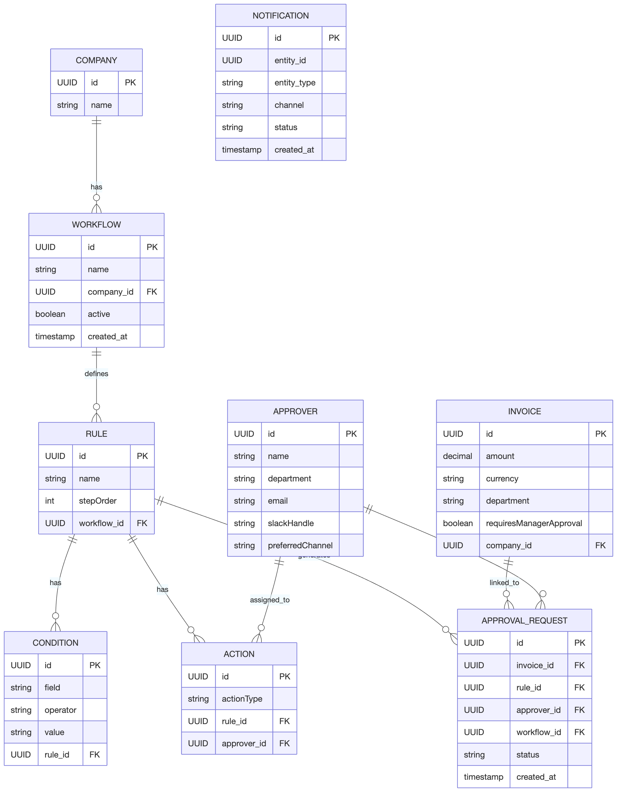

# Approval Workflow Challenge


> **Fig. 1** Workflow added as per requirements  
> **Company ID for above ^:** `00000000-0000-0000-0000-000000000001`

---

## Overview

This project implements a configurable **invoice approval workflow engine**.  
Each company defines a workflow consisting of ordered rules. When an invoice is created, it is evaluated against the active workflow, and approval requests are generated accordingly.


### **High-level Flow**

1. **Invoice creation**
    - Triggered via CLI (`InvoiceApprovalRunner`). This entry point mimics an event-based trigger.
    - CLI collects invoice details (amount, department, manager approval) and submits to `WorkflowService`.

2. **Workflow retrieval & evaluation**
    - `WorkflowService` fetches the **active workflow**.
    - `WorkflowEngine` evaluates all rules sequentially (`stepOrder`) against the invoice.

3. **Action execution**
    - We support only one action type, therefore only `ApprovalRequest` entities are created.
    - Notifications are submitted asynchronously using the `NotificationSender` interface (Slack/Email).
    - Duplicate or already processed approval requests are skipped (idempotent behavior).

---

### Layers
```
├── application — Orchestrates invoice processing.
├── domain — Core business models and logic.
│ ├── model — Entities representing Workflow, Rule, Condition, Action, Invoice, Approver, etc.
│ ├── repository — JPA repositories for database access.
│ └── service — Domain services such as ConditionEvaluator and WorkflowEngine - domain logic, no I/O operations etc. Focused on business rules and calculations, without caring about how they’re triggered or persisted.
├── infrastructure — External system integration (Slack, Email) - we don't use any clients here, but I separated it as if we were.
├── interfaces — User-facing entry points (CLI in this case). Only exists for this reason.
└── resources — Configuration, database initialization, and diagrams. 
```
## Assumptions

While designing and implementing the solution, the following assumptions were made:

1. Each company can define **only one active workflow**. Every new invoice will go through that workflow.
2. A company can modify its workflow at any time, even while the **current** version is actively processing invoices.
3. All amounts are expressed in **USD**.

---

## Additional Assumptions

1. We use H2 in memory db for clarity. Managing everything in memory created too much code.
2. The system is operated via a **CLI**. In a production environment, this would ideally be exposed via **API endpoints**. 
If we had APIs and an interface, we can control and provide options/configs to the UI for the company to edit.
3. Invoice creation via CLI mimics an Invoice Received event.  
   In production, this would be triggered by a real event and act as the workflow trigger.
4. No external workflow engine is used.  
   In a production system, existing solutions for workflow engines could be considered - **eg Temporal, Flowable, Cadence, AWS Step Functions**.
5. Notifications are sent **asynchronously** to decouple them from the `ApprovalRequest` lifecycle.  
   In a real application:
    - A client would receive and deliver the notification.
    - The client would return a response.
    - Batch processing or scheduled jobs could be used to notify approvers for multiple pending invoices.
6. Processing the same invoice ID multiple times does **not** resend notifications.  
   The processor is **idempotent**.
7. Updating a workflow:
    - Creates a new workflow version.
    - Sets the previous version to **inactive**.
    - Requires submitting the **entire workflow configuration** (hence full JSON input in CLI).
    - Previously processed invoices remain linked to the workflow version that processed them.
    - If a workflow is updated while an invoice is being processed, processing completes using the workflow version it started with (no read/write locks are applied).
8. Rule Conditions only evaluate invoice attributes and static configuration, they are "pure" without side effects.
9. Approval Request are open to supporting a lifecycle. This model allows us to implement new features easily - approval process, batch processing (maybe for new notifications).
10. Failures in notification delivery do not fail workflow execution.
11. The CLI is a small orchestration layer, not a business layer. All the business logic lives in application services that can later be reused by APIs, workers, or event consumers.
12. Future improvement for scaling is caching the workflow (rules and actions for the company). This is easy, since we have decoupled it. 
For example, other engines, like in AWS Step Functions - definitions are stored in DB, loaded into memory and cached. And in Temporal, the workflow definitions are versioned and cached in workers.
13. We should introduce an index on companyId and status active for the workflow - I didn't add it, since I am using in memory h2 db.
14. Only basic integration tests are added. In production, everything should be tested, edge cases, happy and unhappy paths.
---

## Database Schema / Model



### Rule Evaluation Order

`stepOrder` determines rule execution order.  
Rules with a lower `stepOrder` are evaluated first.

Example:
>Rule A: stepOrder = 10
>Rule B: stepOrder = 20
>Rule C: stepOrder = 30


The engine evaluates rules sequentially:
>Rule A → Rule B → Rule C

If more than 1 rule results in an action, all actions will be performed.

This enables:

- Conditional flows
- Decision-based branching
- Structured progression through workflow logic

The schema also supports workflows where multiple rules can trigger simultaneously if conditions are not mutually exclusive.

> **Current limitation:** 
> The application currently supports only sending approval notifications (`CREATE_APPROVAL_REQUEST`).

---

## Running the Application

```bash
mvn clean package
java -jar target/invoice-approval-1.0.0.jar
```

## Creating a Workflow 
When adding a new workflow for the company, the old one is updated to inactive. A company only has 1 active workflow at a time.

Supported Operations

| Field                     | Type       | Supported Operators            |
| ------------------------- | ---------- | ------------------------------ |
| `amount`                  | BigDecimal | Numeric operators              |
| `department`              | String     | EQ, NEQ                        |
| `requiresManagerApproval` | Boolean    | EQ, NEQ (`"true"` / `"false"`) |


| Operator | Meaning |
| -------- | ------- |
| `EQ`     | == 0    |
| `NEQ`    | != 0    |
| `GT`     | > 0     |
| `GTE`    | >= 0    |
| `LT`     | < 0     |
| `LTE`    | <= 0    |

Example Workflow JSON

Use the following JSON to create a new workflow (Action [2] in CLI). 
You can change the company id and it will tell you such company doesn't exist.
The json bellow has some tiny changes that you can test.

Important:
Edit the JSON before pasting it into the CLI.
The Scanner reads only the initial pasted content and ignores subsequent edits.

```json
{
  "companyId": "00000000-0000-0000-0000-000000000001",
  "name": "Light Invoice Approval Workflow v2",
  "rules": [
    {
      "name": "A1 — Small invoice to finance team",
      "stepOrder": 10,
      "conditions": [
        { "field": "amount", "operator": "LTE", "value": "100.00" }
      ],
      "actions": [
        { "actionType": "CREATE_APPROVAL_REQUEST", "approverId": "00000000-0000-0000-0000-000000000011" }
      ]
    },
    {
      "name": "A3 — Mid invoice, manager approval required",
      "stepOrder": 30,
      "conditions": [
        { "field": "amount", "operator": "GT", "value": "50.00" },
        { "field": "amount", "operator": "LTE", "value": "100.00" },
        { "field": "requiresManagerApproval", "operator": "EQ", "value": "true" }
      ],
      "actions": [
        { "actionType": "CREATE_APPROVAL_REQUEST", "approverId": "00000000-0000-0000-0000-000000000012" }
      ]
    },
    {
      "name": "B1 — Large non-marketing invoice to CFO",
      "stepOrder": 40,
      "conditions": [
        { "field": "amount", "operator": "GT", "value": "100.00" },
        { "field": "department", "operator": "NEQ", "value": "Marketing" }
      ],
      "actions": [
        { "actionType": "CREATE_APPROVAL_REQUEST", "approverId": "00000000-0000-0000-0000-000000000013" }
      ]
    }
  ]
}
```
